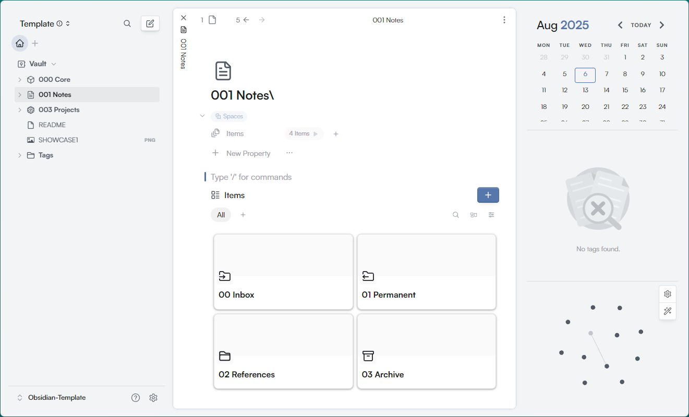
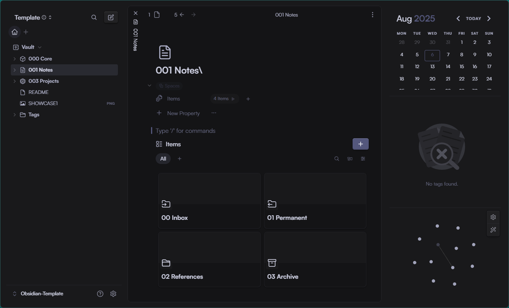

# 📚 Obsidian Universal Template

| Showcase 1 | Showcase 2 |
|:----------:|:----------:|
|  |  |

> **Template profesional para Obsidian que combina las mejores metodologías de gestión del conocimiento: Zettelkasten, PARA Method y GTD.**

## 🌟 Características

- **🗂️ Organización numérica** para mantener orden perfecto
- **🎨 Iconos visuales** con Lucide stickers para identificación rápida  
- **📝 Sistema híbrido** que combina Zettelkasten, PARA Method y GTD
- **🔌 Plugins preconfigurados** para máxima productividad
- **🎯 Escalable** y adaptable a cualquier flujo de trabajo

## 📁 Estructura del Vault

```text
📦 Obsidian-Template/
├── 📦 000 Core/              # Sistema fundamental
│   ├── 🖼️ Resources/         # Materiales de referencia
│   └── 📄 Templates/         # Plantillas reutilizables
├── 📝 001 Notes/             # Sistema de notas
│   ├── 📥 00 Inbox/          # Bandeja de entrada
│   ├── 📤 01 Permanent/      # Notas permanentes procesadas
│   ├── 📋 02 References/     # Referencias y citas
│   └── 🗃️ 03 Archive/        # Archivo de notas antiguas
└── 📦 003 Projects/          # Gestión de proyectos activos
```

## 🚀 Instalación

```bash
git clone https://github.com/Deivis44/Obsidian-Template.git
```

1. Abre Obsidian y selecciona **"Abrir carpeta como vault"**
2. Selecciona la carpeta descargada
3. Confirma la instalación de plugins cuando aparezca el mensaje
4. ¡Listo! Empieza capturando ideas en `00 Inbox`

## 🔌 Plugins de Comunidad Incluidos

Este template viene con **9 plugins de comunidad** preconfigurados y listos para usar:

### 🔍 **Búsqueda y Navegación**

- **Omnisearch** `v1.26.1` - Motor de búsqueda avanzado que indexa todo el contenido
- **Pane Relief** - Historial de navegación mejorado por pestaña

### 🎨 **Organización Visual**

- **make.md** `v1.0.9` - Herramientas avanzadas de organización y espacios de trabajo
- **Iconize** `v2.14.7` - Añade iconos personalizados a archivos, carpetas y texto
- **Style Settings** - Control granular de variables CSS para personalización

### 📅 **Productividad**

- **Calendar** - Vista de calendario integrada para notas diarias
- **Admonition** `v10.3.2` - Callouts mejorados con estilos avanzados
- **Auto Card Link** - Convierte URLs en tarjetas enriquecidas con metadata
- **Image Toolkit** - Herramientas avanzadas para manejo de imágenes

> **✨ Todos los plugins están preconfigurados** - No necesitas configurar nada adicional.

## 🤝 Contribuir

1. Fork el repositorio
2. Crea tu rama feature (`git checkout -b feature/mejora`)
3. Commit tus cambios (`git commit -m 'Añade nueva mejora'`)
4. Push a la rama (`git push origin feature/mejora`)
5. Abre un Pull Request

## 📜 Licencia

Licencia MIT - ve [LICENSE](LICENSE) para más detalles.

---

**¿Te gusta este template?** ⭐ ¡Dale una estrella al repositorio!

*Creado por [Deivis44](https://github.com/Deivis44)*
